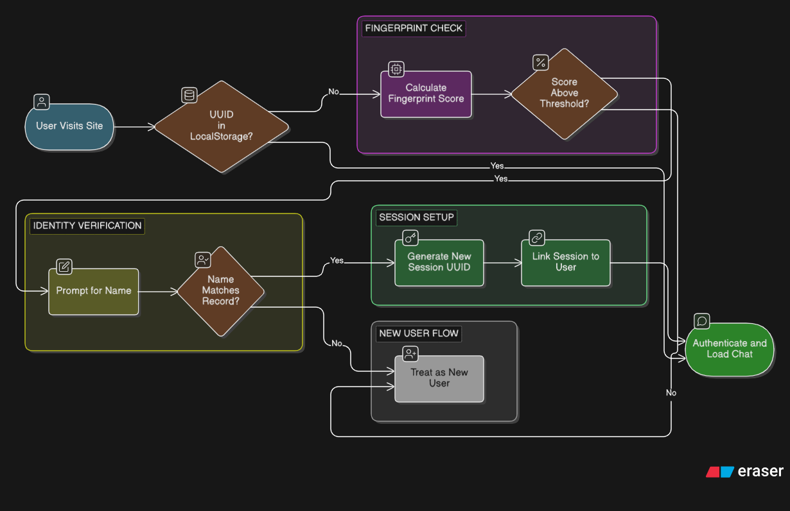
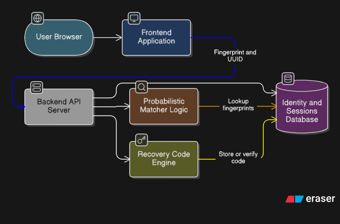

# softAuthentication

A frictionless authentication system that identifies users by **name + device fingerprint** — no signup, no login, no passwords required. Best suited for websites with chat or any lightweight user interaction.

---

## User Flow



---

## Architecture



---

## How It Works

Users enter only their name. The system collects a device fingerprint and generates a **Session UUID** stored in `localStorage` to silently recognize them on return visits.

### First Visit (New User)

1. User enters their name
2. Frontend collects device info: fingerprint, user agent, screen resolution, timezone, language
3. Backend generates a **Session UUID**
4. Records stored in three collections:

**Users**
| Field | Description |
| :--- | :--- |
| `UserId` | Unique identifier for the user |
| `NameHash` | Hashed user name |
| `CreatedAt` | Account creation timestamp |

**Devices**
| Field | Description |
| :--- | :--- |
| `DeviceId` | Unique identifier for the device |
| `UserId` | Linked user |
| `FingerprintHash` | Hashed device fingerprint |
| `UserAgent` | Browser information |
| `FirstSeen` | First time the device was detected |

**Sessions**
| Field | Description |
| :--- | :--- |
| `SessionUUID` | Unique session identifier |
| `DeviceId` | Linked device |
| `CreatedAt` | Session creation time |
| `LastSeen` | Last activity timestamp |

5. UUID saved in `localStorage` — used for all future visits

---

### Returning Visit

- UUID found in `localStorage` → session verified → user continues normally
- UUID missing → proceed to recovery flow below

---

### Missing UUID / Cookie Cleared

1. Backend compares current device fingerprint against stored devices
2. Similarity score calculated (80% threshold)
3. If score ≥ 80% → user asked to enter their name → name hash compared
4. Match found → new UUID generated and stored *(old UUIDs are NOT deleted)*
5. Score < 80% → treated as a new user

---

### Multi-Device / New Browser

Fingerprint + name match an existing user → new session UUID created and linked to the same `UserId`.

| Device | Browser | Session UUID |
| :--- | :--- | :--- |
| Desktop | Chrome | `UUID-1` |
| Desktop | Firefox | `UUID-2` |
| Mobile | Safari | `UUID-3` |

*All sessions are linked to the same `UserId`.*

---

### Recovery Code

For manual recovery across unrecognized devices:
- Short human-readable code (e.g., `ZUHRAN-4912`)
- Stored in the database, linked to `UserId` and session
- Entering the code restores access and links the current device

---

## Edge Cases

| Scenario | Behavior |
| :--- | :--- |
| Cookie cleared | Fingerprint match → ask name → generate new UUID |
| Mobile / new device | Fingerprint + name → new session linked to existing user |
| Two browsers, same device | Each browser gets its own UUID |
| Recovery code entered | Restores previous sessions |
| Fingerprint slightly changed | 70–80% similarity → ask for name |
| Two users with the same name | Fingerprint used as primary identifier |
| Incognito / private browsing | Treated as a new device → new UUID |

---

## Tech Stack

- **Frontend:** React + Vite
- **Backend:** Node.js + Express
- **Database:** MongoDB (Mongoose)
- **Hashing:** bcrypt

---

## Getting Started

### Prerequisites

- Node.js
- MongoDB

### Setup

1. Clone the repo:
   ```bash
   git clone https://github.com/Zuhran110/softAuthentication.git
   cd softAuthentication
   ```

2. Install dependencies:
   ```bash
   cd server && npm install
   cd ../client && npm install
   ```

3. Configure environment variables:

   `server/.env`
   ```
   MONGO_URI=your_mongodb_connection_string
   PORT=5000
   ```

   `client/.env`
   ```
   VITE_BACKEND_URL=http://localhost:5000
   ```

4. Run the app:
   ```bash
   # In /server
   npm run dev

   # In /client
   npm run dev
   ```
